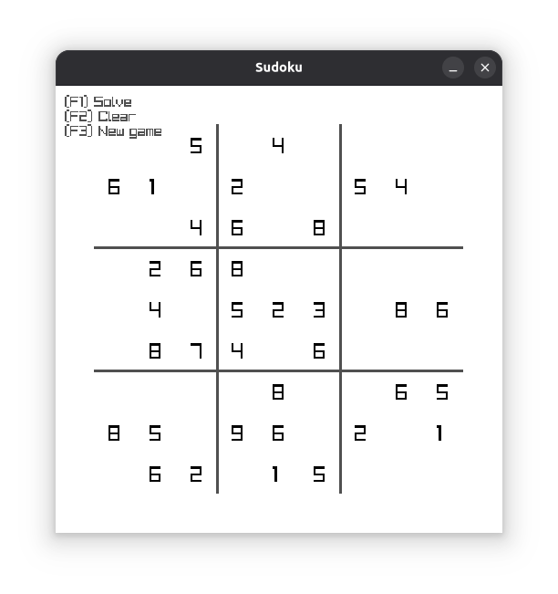

# sudoku
A *very* barebones sudoku game because I was bored.

## Features
- Finds a solution automatically using a backtracking alorithm
- Generates a valid, random game board
- Input by keyboard

## Requirements
Requires [Raylib](https://www.raylib.com/) for *building*
